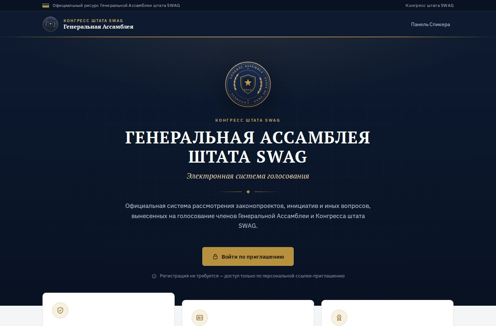
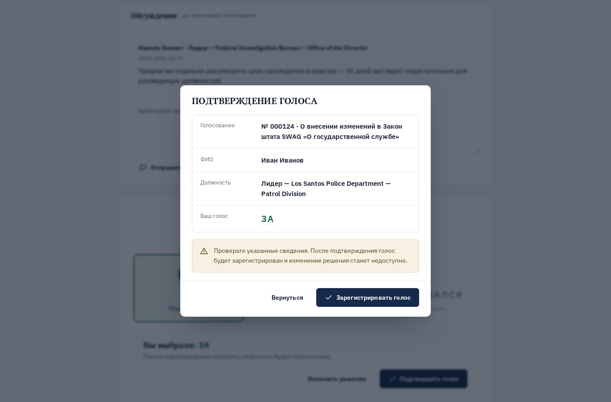
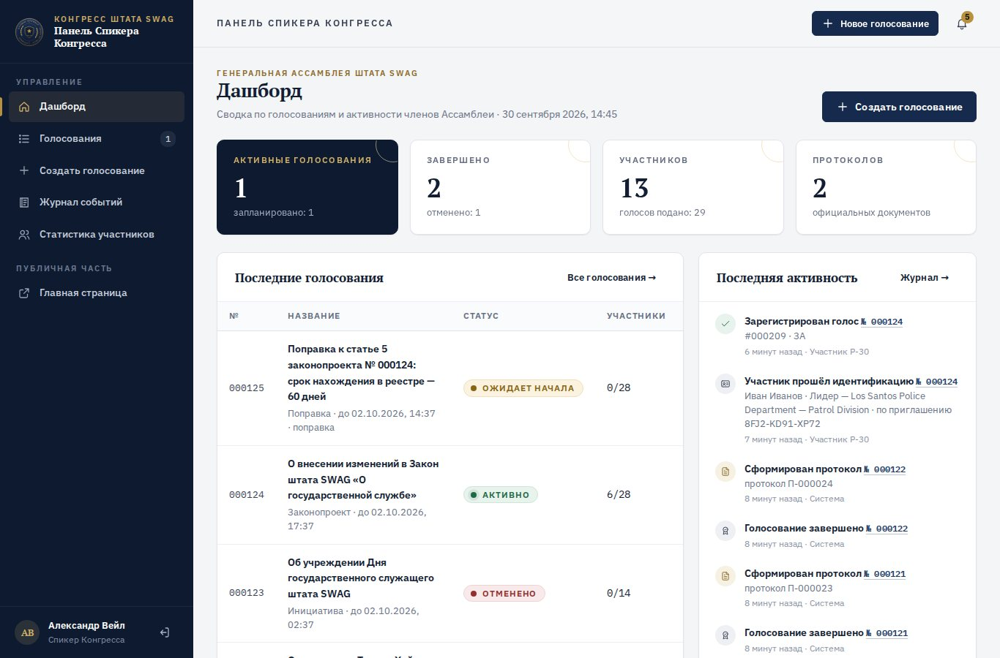
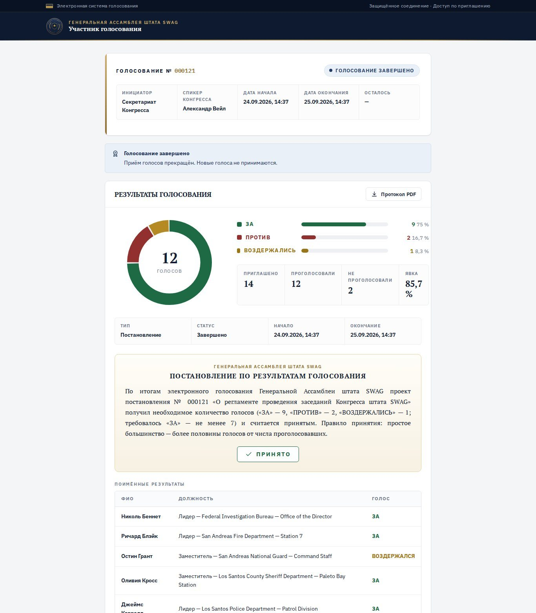
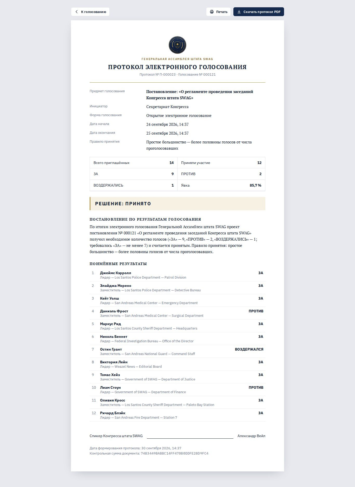

<div align="center">

# 🗳 Генеральная Ассамблея штата SWAG — электронная система голосования

**Голосование по законопроектам, поправкам, кадровым вопросам и инициативам** для Генеральной Ассамблеи и Конгресса RP-штата SWAG — с приглашениями, тайным режимом, автоматическим итогом и официальным протоколом в PDF.

[](https://swag-vote.fegke15.workers.dev)


-003B57?logo=sqlite&logoColor=white)


<br>



</div>

---

Участник получает от Спикера Конгресса ссылку‑приглашение → проходит идентификацию → изучает законопроект → выбирает «ЗА / ПРОТИВ / ВОЗДЕРЖАЛСЯ» → подтверждает → получает номер регистрации голоса. После завершения система сама подводит итог по заданному правилу, формирует постановление и официальный протокол (PDF).

## Скриншоты

<table>
  <tr>
    <td></td>
    <td></td>
  </tr>
  <tr>
    <td align="center"><sub>Подтверждение голоса</sub></td>
    <td align="center"><sub>Панель Спикера Конгресса</sub></td>
  </tr>
  <tr>
    <td></td>
    <td></td>
  </tr>
  <tr>
    <td align="center"><sub>Результаты и постановление</sub></td>
    <td align="center"><sub>Официальный протокол</sub></td>
  </tr>
</table>

---

## Запуск и деплой

Система работает на **Cloudflare Workers** (сервер) + **D1** (база данных, SQLite) + **Cron Triggers** (автозавершение голосований). На бесплатном тарифе Cloudflare этого хватает с большим запасом, сервер не «засыпает».

### Локально

Нужен **Node.js 20+**.

```bash
npm install
npm run dev          # http://localhost:8787 — с демо-данными
npm test             # 29 сквозных проверок на локальном движке Cloudflare
```

Локальные настройки — в файле `.dev.vars` (не попадает в git):

```
SPEAKER_PASSWORD=любой_пароль
SPEAKER_NAME=Имя Фамилия
SEED_DEMO=1
```

- `/` — главная, `/speaker` — панель Спикера (логин `speaker`), `/vote/8FJ2-KD91-XP72` — демо-приглашение.

### В Cloudflare

1. **Storage & databases → D1 → Create** — база `swag-vote`. Её **Database ID** вписать в `wrangler.toml` (`database_id`).
2. **Workers & Pages → Create → Import a repository** — этот репозиторий. Команда деплоя — `npx wrangler deploy` (по умолчанию).
3. **Worker → Settings → Variables and Secrets → Add → Secret**: `SPEAKER_PASSWORD` — пароль Спикера.
4. Готово. Таблицы базы создаются автоматически при первом запросе, cron включается из `wrangler.toml`. Каждый push в `main` деплоится сам.

Или из терминала: `npx wrangler login`, `npx wrangler d1 create swag-vote` (ID → `wrangler.toml`), `npx wrangler secret put SPEAKER_PASSWORD`, `npm run deploy`.

### Настройки (`[vars]` в `wrangler.toml`)

| Переменная | По умолчанию | Назначение |
|---|---|---|
| `SPEAKER_PASSWORD` | — (**секрет**) | Пароль Спикера. Смена секрета = смена пароля |
| `SPEAKER_LOGIN` | `speaker` | Логин Спикера |
| `SPEAKER_NAME` | `Спикер Конгресса` | Имя в протоколах и на страницах голосования |
| `PUBLIC_URL` | адрес запроса | Базовый адрес ссылок-приглашений (если свой домен) |
| `DISPLAY_TZ` | `Europe/Moscow` | Часовой пояс в скачиваемых документах |
| `SEED_DEMO` | `0` | `1` — загрузить демо-голосования в пустую базу |

---

## Архитектура

```
wrangler.toml                конфигурация Worker: D1, статика, cron, переменные
src/
  worker.js                  маршруты API (Hono), выдача страниц, обработчик cron
  lib/schema.js              схема БД + триггеры целостности (применяется автоматически)
  lib/db.js                  обёртка D1, счётчики, распознавание ошибок базы
  lib/util.js                ошибки, валидация, Web Crypto
  services/                  бизнес-логика — все проверки здесь, на сервере
    votes.js                 голосования, статусы, подсчёт, итог, завершение
    participation.js         приглашение → идентификация → регистрация голоса
    invites.js               приглашения: коды, срок, лимит, отзыв, продление
    rules.js                 правила принятия (не зашиты в код — задаются Спикером)
    protocols.js             снимок итогов для протокола (с контрольной суммой)
    events.js                журнал действий и уведомления
    scheduler.js             начало, «осталось 30 минут», автозавершение, протоколы
    auth.js                  вход Спикера (секрет + серверные сессии)
    markdown.js, documents.js  текст законопроекта и его скачиваемая версия
    seed.js                  демо-данные
public/                      фронтенд без сборки; PDF протокола собирается в браузере (pdfmake)
test/e2e.js                  сквозные тесты
```

**Frontend** — только интерфейс. **Backend** (Worker) — все решения: авторизация приглашений, регистрация голосов, проверка повторного голосования, подсчёт, итог, протоколы. **Database** (D1) — пользователи, сессии, голосования, редакции, приложения, приглашения, участники, бюллетени, протоколы, журнал, уведомления, комментарии, ограничения частоты запросов.

Код работает с базой через `src/lib/db.js` и обычный SQL — при необходимости переносится на PostgreSQL (например, через Hyperdrive) заменой этого модуля.

---

## Защита голосования

- Браузеру доверяется только выбор варианта. Кто голосует, по какому голосованию, можно ли ещё голосовать — определяет сервер.
- Участник получает `httpOnly`‑cookie с токеном; в БД хранится только его SHA‑256.
- **Один человек — один голос**: уникальность нормализованного ФИО в пределах голосования (`UNIQUE(vote_id, name_key)`), атомарная отметка `has_voted`, уникальный бюллетень на участника.
- Лимит приглашения (`max_uses`) проверяется в базе; опция «одно устройство — один участник».
- Ключевые гарантии закреплены **триггерами базы данных**: голос принимается только в активном голосовании, повторный голос невозможен, приглашение нельзя использовать сверх лимита, после срока или отзыва. Даже ошибка в коде не позволит их нарушить.
- **Тайное голосование**: бюллетень пишется без `participant_id` и без времени, со случайным id и номером — сопоставить участника и выбор невозможно ни по ссылке, ни по порядку записей. Выбор не попадает в журнал и уведомления; промежуточный подсчёт скрыт от Спикера до завершения.
- Промежуточные результаты участникам не показываются; после завершения — только если Спикер разрешил.
- Панель Спикера: пароль — секрет Cloudflare (не хранится в базе), серверные сессии, `SameSite=Strict`, лимит попыток входа (хранится в D1). Защита Cloudflare от DDoS — автоматически.
- Все изменяющие запросы — только JSON с того же сайта (защита от CSRF), строгий CSP, текст законопроекта экранируется.
- Протокол содержит контрольную сумму снимка итогов.

---

## Возможности

**Участник:** вход по ссылке/коду/QR · идентификация (Лидер / Заместитель / вручную + департамент и подразделение) · таймер · полный текст с оглавлением (статьи, пункты, подпункты, таблицы, важные положения) · скачивание документа · приложения · обсуждение · выбор → подтверждение → модальное окно → номер голоса · понятные экраны ошибок · уведомления · итоги с диаграммой, постановлением и протоколом PDF.

**Спикер:** дашборд · реестр голосований (статусы, поиск, тип, даты — архив законопроектов) · создание (8 типов, редактор с предпросмотром, сроки, правило, кворум, тайное/открытое, настройки публикации, приглашение) · приглашения (копировать, QR SVG/PNG, отозвать, продлить, новые ссылки) · участники (✓ / ◷, сброс идентификации) · редакции текста с историей · прикрепление документов · модерация обсуждения · перенос, продление, досрочное завершение, отмена · фиксация решения при ручном правиле · повторное голосование · вынесение поправки отдельным голосованием · экспорт CSV/JSON · протокол HTML (печать) и PDF · журнал событий · статистика активности членов Ассамблеи · уведомления.

**Правила принятия:** простое большинство · квалифицированное (любая доля) · единогласно · необходимое число голосов «ЗА» · порог в % · решение Спикера по итогам. База: от проголосовавших / от «ЗА»+«ПРОТИВ» / от приглашённых. Кворум: число или процент.

### Задел на развитие

Схема и сервисы рассчитаны на расширение. Следующий логичный шаг — несколько вопросов в одном голосовании: таблица `vote_questions`, у бюллетеня появляется `question_id`, подсчёт и протокол группируются по вопросам. Загрузка файлов (сейчас приложения — ссылки) — добавить хранилище (S3/диск) и таблицу `files`.

---
